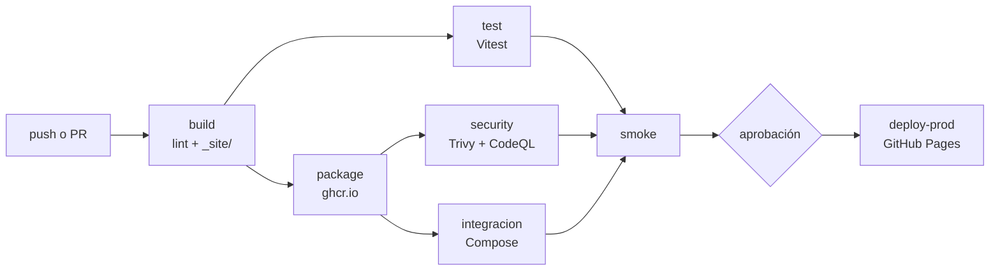

# Perfil — Kiara De La Vega

[](https://github.com/KrisD08/KrisD08.github.io/actions/workflows/ci-cd.yml)

Sitio personal publicado en https://KrisD08.github.io, con un libro de
visitas de tres servicios en contenedores (LAB-02, IF-1116) y un pipeline
de CI/CD que lo construye, prueba, empaqueta, escanea y publica (LAB-03).

---

## El pipeline (LAB-03)

Todo está en [`.github/workflows/ci-cd.yml`](.github/workflows/ci-cd.yml). Cada cambio recorre
estas etapas; si una falla, las que dependen de ella no corren.



| Job | Qué hace | Falla si... |
|---|---|---|
| `build` | Hadolint (Dockerfile), HTMLHint (`index.html`), ESLint (API y JS del navegador); arma `_site/` con solo lo público y lo sube como artefacto de Pages | un linter encuentra un error |
| `test` | Descarga **ese mismo** artefacto y le corre Vitest (`tests/sitio.test.js`) | alguna prueba falla |
| `package` | Construye `perfil-web` y `perfil-api` y las sube a GitHub Packages con el tag `sha-<commit>` | no se puede construir o publicar |
| `security` | CodeQL sobre mi código y Trivy sobre las dos imágenes; publica los hallazgos en *Security → Code scanning* | hay una vulnerabilidad `CRITICAL` **con corrección disponible** |
| `integracion` | Levanta `web`+`api`+`db` con Compose usando las imágenes del commit y prueba el contrato de la API pasando por nginx | el contrato de la API no se cumple |
| `smoke` | Descarga `perfil-web` del commit (la misma que escaneó Trivy), la levanta y comprueba `GET /` → 200 con mi nombre | no responde 200 o falta mi nombre |
| `deploy-prod` | Publica `_site/` en GitHub Pages **después de una aprobación manual** y revisa la URL publicada | la página publicada no responde o rompe |

- Un **pull request** llega hasta `smoke`; `deploy-prod` no corre. Solo un **push a `main`** despliega.
- La rama `main` está protegida: no se puede hacer merge si fallan `build`, `test`, `package`, `security`, `integracion` o `smoke`.
- GitHub Pages se publica desde **GitHub Actions** (no desde la rama): solo se sube `_site/`, así que `compose.yaml`, `api/`, `db/` y `.env.example` ya no son públicos.

### Correr lo mismo en mi máquina

```bash
npm ci               # instala Vitest, jsdom, HTMLHint y ESLint
npm run lint:html    # HTMLHint
npm run lint:js      # ESLint
npm run sitio        # arma _site/
npm test             # Vitest sobre _site/
```

---

## Delivery o deployment

Mi pipeline es **Continuous Delivery**: de `build` a `smoke` todo es automático, y el paso a producción
(`deploy-prod`) espera a que yo lo apruebe. Esa espera no está escrita en el YAML: la produce el *environment*
`github-pages`, que tiene configurado *Required reviewers*.

**Qué cambiaría para pasar a Continuous Deployment:**

1. En *Settings → Environments → github-pages* quito *Required reviewers*. Con eso `deploy-prod` corre apenas
   termina `smoke`. **No cambia ninguna línea del workflow**: es un cambio de configuración, no de código.
2. Antes de quitarla reforzaría lo que hoy cubre mi aprobación: pruebas más completas (que `smoke` e
   `integracion` sean lo bastante buenas como para confiar sin mirar) y que la revisión de producción de
   `deploy-prod` (`scripts/comprobar-produccion.mjs`) **vuelva atrás sola** si falla. Hoy, si falla, el job se
   pone en rojo pero la versión mala queda publicada hasta que yo haga el *revert*.

**En qué casos no lo haría:**

- Cuando un error en producción no se puede deshacer fácil: migraciones de base de datos, correos o
  notificaciones ya enviadas, borrado de datos. El libro de visitas tiene una base de datos real (`db`).
- Cuando el contenido necesita que una persona lo revise antes de hacerse público (textos legales, datos
  personales, mi nombre y mi correo en el perfil).
- Cuando las pruebas automáticas todavía no cubren lo importante: si el pipeline se pone en verde pero nadie
  probó lo que cambió, quitar la aprobación solo quita la última red de seguridad.
- Cuando hay normas o auditorías que exigen una aprobación explícita y con registro.

Para este perfil, que en GitHub Pages se publica sin API ni base de datos, Continuous Deployment sería
razonable. Dejé la aprobación porque el laboratorio pide ver dónde está esa frontera.

---

## Volver a una versión anterior de producción

La regla: **todo cambio a producción pasa por el pipeline**, también el de volver atrás.

1. En GitHub, abro el pull request que causó el problema (ya mergeado) y pulso **Revert**. Eso crea un pull
   request nuevo con el `git revert` del cambio.
2. Ese PR pasa por `build`, `test`, `package`, `security`, `integracion` y `smoke`, igual que cualquier otro.
3. Hago merge, apruebo `deploy-prod` y la versión anterior vuelve a estar publicada.

**Lo probé:**

| Paso | Enlace |
|---|---|
| Cambio visible en la nota de la portada | [PR #28](https://github.com/KrisD08/KrisD08.github.io/pull/28) |
| Despliegue de ese cambio | [run 37552857830](https://github.com/KrisD08/KrisD08.github.io/actions/runs/37552857830) |
| Revert del cambio | [PR #29](https://github.com/KrisD08/KrisD08.github.io/pull/29) |
| Despliegue del revert | [run 37553707865](https://github.com/KrisD08/KrisD08.github.io/actions/runs/37553707865) |

Después del revert la página volvió a mostrar el texto original de la nota de la portada
("Datos · Tecnología · Creatividad").

Alternativas que descarté:

- **Volver a correr un despliegue viejo** (*Re-run all jobs* sobre un run antiguo en Actions): es rápido, pero el
  historial de `main` sigue diciendo que la versión mala es la actual, y los artefactos de Pages expiran (1 día
  por defecto), así que solo serviría *Re-run all jobs* y no *Re-run failed jobs*.
- **Revertir sin PR** (`git push` directo a `main`): la protección de rama lo impide, y con razón.

---

## Reto 1: tiempos del pipeline

Los tiempos salen de la API de Actions (`started_at` y `completed_at` de cada job) y son de runs de **pull
request**, para no contar la espera de la aprobación de `deploy-prod`.

- **Antes:** [run 37543729131](https://github.com/KrisD08/KrisD08.github.io/actions/runs/37543729131), el primer
  run en verde del pipeline base (PR #20).
- **Después:** [run 37552614359](https://github.com/KrisD08/KrisD08.github.io/actions/runs/37552614359), PR #28, con
  el pipeline final y las cachés ya llenas.

| Job | Antes (base) | Después (final) | Qué cambió |
|---|--:|--:|---|
| build | 14 s | 17 s | caché de npm |
| test | 12 s | 19 s | corre en paralelo con `package` |
| package | 34 s | 24 s | caché de capas de Docker |
| security | 23 s | 100 s | ahora incluye CodeQL, informes SARIF y JSON, resumen |
| integracion | — | 35 s | job nuevo, en paralelo con `security` |
| smoke | 5 s | 7 s | sin cambios |
| **Total del run** | **105 s** | **159 s** | **51 % más lento** |

**No cumplí el criterio de −30 %.** El pipeline final es más lento que el base porque hace bastante más trabajo:
solo el job `security` pasó de 23 s a unos 100 s (CodeQL tarda alrededor de 50 s entre preparar y analizar, y
hay seis ejecuciones de Trivy más la subida de resultados). Las cachés y el paralelismo ahorraron tiempo en
`package`, pero mi pipeline base ya era corto (1 min 45 s), así que no alcanzaron para compensar los jobs nuevos.
Más abajo, en la bitácora del Reto 1, explico qué haría distinto.

---

## Bitácora de decisiones

### Reto 1: Imagen mínima con multi-stage

- **Decisión:** el `Dockerfile` de `api/` utiliza dos etapas: `deps` (Node completo, donde se instalan las dependencias con npm) y `runtime`, basada en `gcr.io/distroless/nodejs20-debian12:nonroot`, que únicamente copia `node_modules` y el código final necesario para ejecutar la aplicación.

- **Alternativas que evalué:**
  - `node:20-alpine` como imagen final: es mucho más pequeña que la imagen completa de Node, pero todavía incluye shell y gestor de paquetes que no son necesarios en producción.
  - `node:20-slim`: ofrece mayor compatibilidad al utilizar Debian como base, pero mantiene un tamaño superior frente a una imagen distroless.

- **Por qué elegí esta:** distroless elimina herramientas innecesarias como shell, npm y gestores de paquetes. Esto reduce la superficie de ataque, ya que ante una posible intrusión no existen comandos adicionales disponibles dentro del contenedor. Además, al ser una API desarrollada en JavaScript puro sin dependencias nativas, no existe riesgo de incompatibilidad.

- **Fuentes consultadas:**
  - Página oficial de [`distroless`](https://github.com/GoogleContainerTools/distroless) en GitHub.
  - Documentación oficial de Docker sobre multi-stage builds.

- **Cómo lo verifiqué:** ejecuté `docker images` obteniendo el tamaño optimizado real:

```yaml
REPOSITORY                   TAG       ID             DISK USAGE    CONTENT SIZE
krisd08githubio-api:latest   c9267900c02f   177MB         45.5MB    U
```

- **Qué no me funcionó:** al probar distroless inicialmente, los intentos de ingresar al contenedor mediante comandos como `sh` fallaban porque la imagen no contiene shell ni herramientas del sistema. Esto confirmó la seguridad de la imagen, pero requirió utilizar logs del contenedor para la depuración.


### Reto 2: Arranque ordenado con healthchecks

- **Decisión:** cada servicio cuenta con su propio `HEALTHCHECK` y el archivo `compose.yaml` utiliza `depends_on: condition: service_healthy`, logrando que:
  - `api` espere hasta que `db` se encuentre saludable.
  - `web` espere hasta que `api` esté disponible.

- **Alternativas que evalué:**
  - Utilizar únicamente `depends_on`: inicia los contenedores en orden, pero no garantiza que el servicio interno ya acepte conexiones.
  - Usar un script como `wait-for-it.sh`: permite esperar conexiones, pero agrega una dependencia externa y traslada la responsabilidad del estado saludable fuera de Docker.

- **Por qué elegí esta:** los `HEALTHCHECK` son mecanismos nativos de Docker Compose, no requieren instalar herramientas adicionales y permiten aprovechar correctamente el inicio automático mediante `postStartCommand`.

- **Fuentes consultadas:**
  - Documentación oficial de Docker Compose sobre `healthcheck` y `depends_on`.
  - Manual de la utilidad `pg_isready`.

- **Cómo lo verifiqué:** ejecuté:

```bash
docker compose ps
```

Resultado:

```bash
NAME                   IMAGE                   COMMAND                  SERVICE   STATUS

krisd08githubio-api-1  krisd08githubio-api     "/nodejs/bin/node ap…"   api       Up (healthy)

krisd08githubio-db-1   postgres:16-alpine      "docker-entrypoint.s…"   db        Up (healthy)
```

- **Qué no me funcionó:** inicialmente intenté utilizar `curl` dentro del healthcheck de la API, pero falló debido a que Distroless no incluye herramientas de red. Finalmente se implementó un chequeo utilizando funcionalidades propias de Node.js.


### Reto 3: Nadie es root

- **Decisión:** 
  - `web` utiliza `nginxinc/nginx-unprivileged`, que funciona en el puerto 8080 y ejecuta el proceso con el usuario `nginx`.
  - `api` utiliza `gcr.io/distroless/nodejs20-debian12:nonroot`, ejecutando con el usuario sin privilegios UID 65532.
  - `db` utiliza la imagen oficial de PostgreSQL, que ejecuta el servicio mediante el usuario interno `postgres`.

- **Alternativas que evalué:**
  - Utilizar `nginx:alpine` junto con `USER nginx`: requiere configuraciones adicionales porque el puerto 80 necesita privilegios especiales (`CAP_NET_BIND_SERVICE`).

- **Por qué elegí esta:** reduce la cantidad de configuraciones manuales y utiliza imágenes diseñadas específicamente para ejecución segura sin privilegios administrativos.

- **Fuentes consultadas:**
  - Repositorio oficial de `nginxinc/nginx-unprivileged`.
  - Documentación de seguridad de Google Distroless.

- **Cómo lo verifiqué:** ejecuté:

```bash
for s in web api db; do echo -n "$s: "; docker compose exec $s whoami; done
```

Resultado obtenido:

```bash
api: executable file not found in $PATH
```

Esto ocurre porque Distroless no incluye herramientas como `whoami`, shell u otros binarios del sistema, confirmando que la imagen mantiene un entorno mínimo.

- **Qué no me funcionó:** intentar explorar el contenedor API mediante `docker compose exec api sh` no fue posible debido a que Distroless elimina completamente la consola shell.


### Reto 4: Red segmentada

- **Decisión:** se configuraron dos redes independientes en `compose.yaml`:

  - `frontend`: conecta únicamente `web` con `api`.
  - `backend`: conecta únicamente `api` con `db`.

  La API funciona como único punto intermedio entre ambas redes. Ni la API ni la base de datos exponen puertos directamente hacia el host.

- **Alternativas que evalué:**
  - Utilizar una sola red para todos los servicios: aunque es más simple, permitiría que `web` tenga acceso directo a `db`, aumentando la superficie de exposición.

- **Por qué elegí esta:** aplica el principio de mínimo privilegio, permitiendo que cada servicio solamente tenga comunicación con los componentes necesarios.

- **Fuentes consultadas:**
  - Documentación oficial de Docker Compose sobre redes (`networks`).

- **Cómo lo verifiqué:** intenté realizar pruebas de resolución entre servicios:

```bash
docker compose exec web getent hosts db

docker compose exec api getent hosts db
```

La comprobación desde servicios basados en Distroless no pudo ejecutarse porque no cuentan con herramientas de red instaladas, lo cual demuestra el aislamiento de la imagen base.


- **Qué no me funcionó:** inicialmente al trabajar con una única red por defecto, los servicios tenían comunicación directa entre sí. La separación en dos redes permitió corregir este problema.


### Reto 5: Escaneo de vulnerabilidades

- **Decisión:** se realizó un análisis de seguridad sobre la imagen publicada en GHCR:

```
ghcr.io/krisd08/perfil-api:v1.0
```

utilizando Trivy para identificar vulnerabilidades provenientes de la imagen base y dependencias utilizadas.

- **Alternativas que evalué:**
  - **Trivy (Aquasecurity):** elegida por ser open source, compatible con registros como GHCR y fácil de ejecutar localmente.
  - **Docker Scout:** tiene integración directa con Docker CLI, pero está más ligado al ecosistema comercial de Docker.

- **Por qué elegí esta:** Trivy permite realizar auditorías rápidas mostrando vulnerabilidades del sistema operativo y paquetes utilizados dentro de la imagen.

- **Fuentes consultadas:**
  - Documentación oficial de [Trivy](https://trivy.dev/).
  - Base de datos de vulnerabilidades [AVD](https://avd.aquasec.com/).

- **Cómo lo verifiqué:** ejecuté:

```bash
docker run --rm aquasec/trivy:latest image ghcr.io/krisd08/perfil-api:v1.0
```

Resultado resumido:

```text
CRITICAL: 1
HIGH: 5
MEDIUM: 23
LOW: 25
UNKNOWN: 1
```

- **Análisis de la vulnerabilidad crítica:**

  - **CVE:** `CVE-2026-31789`
  - **Severidad:** CRITICAL
  - **Paquete afectado:** `libssl3` (OpenSSL)

- **Decisión tomada:** se mantiene temporalmente debido a que corresponde a una vulnerabilidad del paquete base Debian y se espera la actualización del parche upstream.

- **Qué no me funcionó:** inicialmente ejecutar Trivy sin indicar correctamente la etiqueta `v1.0` generaba un error de manifiesto desconocido.


### Reto 6: Cero secretos y arranque automático

- **Decisión:** el archivo `.env` está incluido dentro de `.gitignore`, evitando que pueda ser subido al repositorio. Se creó `.env.example` como plantilla con valores de prueba.

Además, dentro de `.devcontainer/devcontainer.json`, el `postCreateCommand` copia automáticamente `.env.example` hacia `.env` únicamente si este archivo todavía no existe.

- **Alternativas que evalué:**
  - Utilizar GitHub Codespaces Secrets: fue descartado porque requiere configuración individual de cuenta y dificulta la evaluación automática del proyecto.

- **Por qué elegí esta:** permite mantener un entorno reproducible y seguro, evitando exponer credenciales reales mientras mantiene el arranque automático en nuevos Codespaces.

- **Fuentes consultadas:**
  - Documentación oficial de Docker Compose sobre `env_file`.
  - Documentación de GitHub Codespaces Secrets.

- **Cómo lo verifiqué:** ejecuté:

```bash
git log --all --full-history -- .env
```

Resultado:

```text
(no se devolvió ningún registro)
```

Esto confirma que el archivo `.env` nunca fue versionado ni enviado al repositorio.

- **Qué no me funcionó:** no se presentaron problemas adicionales debido a que la protección mediante `.gitignore` fue configurada desde el inicio.

---

## Bitácora de decisiones: LAB-03

Los enlaces a runs y pull requests son de este repositorio. Las capturas están en
[`docs/evidencias/`](docs/evidencias/).

### Nivel base: lo que falló en el primer pull request

El primer PR del pipeline (#20) falló tres veces antes de ponerse en verde. Cada fallo era un problema real:

| Run | Job y paso | Qué pasó | Cómo lo arreglé |
|---|---|---|---|
| [37541816941](https://github.com/KrisD08/KrisD08.github.io/actions/runs/37541816941) | `build`, Hadolint | Regla **DL3025**: el `HEALTHCHECK` de `web/Dockerfile` y `db/Dockerfile` estaba en forma de texto y la regla pide la forma JSON | Pasé el `CMD` del `HEALTHCHECK` a notación JSON en los dos Dockerfile, sin apagar la regla |
| [37542465306](https://github.com/KrisD08/KrisD08.github.io/actions/runs/37542465306) | `security`, Trivy `perfil-web` | `CVE-2026-31789` (CRITICAL, con corrección) en `libcrypto3` y `libssl3` de Alpine 3.21; la imagen base era `nginx-unprivileged:1.27-alpine` | Subí la base a `nginxinc/nginx-unprivileged:1.30.5-alpine3.24` |
| [37542914723](https://github.com/KrisD08/KrisD08.github.io/actions/runs/37542914723) | `security`, Trivy `perfil-api` | El mismo CVE en `libssl3` de la imagen distroless (Debian 12): el parche existe en Debian pero la imagen base todavía no lo trae | Lo acepté en `.trivyignore` con motivo y fecha de vencimiento (ver Reto 2) |

Los runs en rojo de las pruebas intencionales:

- **`build` en rojo:** [run 37546883471](https://github.com/KrisD08/KrisD08.github.io/actions/runs/37546883471)
  (PR #21): un `` sin `alt`, y HTMLHint se puso en rojo.
- **`test` en rojo:** [run 37547272267](https://github.com/KrisD08/KrisD08.github.io/actions/runs/37547272267)
  (PR #22): cambié el nombre del `h1`, y Vitest se puso en rojo.

### B3: ¿Cómo le llega `_site/` al job `test`?

- **Decisión:** `build` arma `_site/` y lo sube con `actions/upload-pages-artifact` (artefacto `github-pages`).
  `test` lo baja con `actions/download-artifact` y lo desempaqueta (`tar -xf artefacto/artifact.tar -C _site`).
  `deploy-prod` publica ese mismo artefacto.
- **Alternativas que evalué:**
  - Volver a armar `_site/` en cada job con el mismo script: es simple y no depende de artefactos, pero son dos
    construcciones distintas; si algún día difieren, pruebo una carpeta y publico otra.
  - Subir `_site/` además como un artefacto normal con `actions/upload-artifact`: sirve, pero duplica el artefacto
    y de todos modos el que se despliega es el de Pages.
- **Por qué elegí esta:** es el único camino donde lo que se prueba y lo que se publica son exactamente los mismos
  bytes: un solo artefacto, subido una vez, usado por `test` y por `deploy-prod`.
- **Fuentes consultadas:** [`actions/upload-pages-artifact`](https://github.com/actions/upload-pages-artifact) (su
  `action.yml` muestra que empaqueta en `artifact.tar`) y
  [`actions/download-artifact`](https://github.com/actions/download-artifact).
- **Cómo lo verifiqué:** `test` en verde en el [run 37548135847](https://github.com/KrisD08/KrisD08.github.io/actions/runs/37548135847);
  y en rojo cuando cambié el `h1` ([run 37547272267](https://github.com/KrisD08/KrisD08.github.io/actions/runs/37547272267)).
- **Qué no me funcionó:** no tuve problemas con este paso: el job `test` descargó y desempaquetó el artefacto desde
  el primer run del pipeline final.

### Reto 1: Pipeline rápido

- **Decisión:** caché de npm en `actions/setup-node` (`cache: npm`), caché de capas de Docker en
  `docker/build-push-action` (`cache-from` y `cache-to` con `type=gha`, un `scope` por imagen), caché de la base
  de datos de Trivy (viene incluida en `aquasecurity/trivy-action`) y Trivy instalado una sola vez
  (`skip-setup-trivy`). En paralelo: `test` con `package`, e `integracion` con `security`. `smoke` espera a todos.
- **Alternativas que evalué:**
  - Solo cachés, sin paralelismo: no cambia la estructura del pipeline, pero el camino crítico sigue siendo largo.
  - `package` como matriz (`web` y `api` en paralelo): ahorra unos segundos, pero cambia los nombres de los
    checks (`package (web)`) y complica la protección de rama.
- **Por qué elegí esta:** ninguna compuerta se salta: `deploy-prod` sigue exigiendo que pasen todas. `test` y
  `package` no se necesitan entre sí (uno revisa el sitio, el otro construye imágenes).
- **Fuentes consultadas:** [`docker/build-push-action`](https://github.com/docker/build-push-action) (opciones
  `cache-from` y `cache-to`), [`actions/setup-node`](https://github.com/actions/setup-node) (opción `cache`) y
  [`aquasecurity/trivy-action`](https://github.com/aquasecurity/trivy-action) (opciones `cache` y `skip-setup-trivy`).
- **Cómo lo verifiqué:** tabla de la sección "Reto 1: tiempos del pipeline", con los enlaces a los dos runs.
- **Qué no me funcionó:** **no llegué al −30 %**: el pipeline pasó de 105 s a 159 s. Lo que aprendí:
  - El pipeline base ya era corto, y el final suma trabajo que el base no hacía: CodeQL (SAST), cuatro ejecuciones
    más de Trivy (informes SARIF y JSON), subida a Code scanning y el job `integracion`.
  - El camino crítico del run final es `build` → `package` → `security` → `smoke`, y `security` por sí solo dura
    unos 100 s.
  - Lo que haría distinto: sacar CodeQL y los informes de Trivy a un job que corra en paralelo desde el inicio, en
    vez de ponerlos en serie dentro de `security`, y comparar contra una línea base que incluya los mismos
    chequeos.

### Reto 2: SAST y resultados a la vista

- **Decisión:** CodeQL (`github/codeql-action`, lenguaje `javascript-typescript`, suite `security-extended`)
  corre en el job `security` sobre `api/app.js` y `libro-de-visitas.js`. Los hallazgos de Trivy se suben en
  formato SARIF con `upload-sarif` (categorías `trivy-web` y `trivy-api`). El permiso extra es
  `security-events: write`, solo en ese job. Además hay un `.trivyignore` con una vulnerabilidad aceptada y su
  motivo.
- **Alternativas que evalué:** Semgrep (reglas muy flexibles, pero hay que instalarlo, fijar su versión y subir el
  SARIF a mano) y Bandit (solo analiza Python, y mi API es Node.js).
- **Por qué elegí esta:** CodeQL sube sus resultados a Code scanning sin pasos extra, y la acción se fija por SHA
  como las demás.
- **Qué muestran las capturas:**
  - En *Security → Code scanning* aparecen las dos herramientas, **CodeQL** y **Trivy**
    ([herramientas](docs/evidencias/r2_code.jpeg), [Trivy](docs/evidencias/r2_trivy.jpeg)). CodeQL analizó 1 archivo
    de GitHub Actions, 1 HTML y 9 de JavaScript.
  - El job `security` con los pasos de CodeQL y de Trivy en verde: [captura](docs/evidencias/r2_security.jpeg).
  - No hubo alertas
- **Sobre `.trivyignore`:** acepté `CVE-2026-31789`, de OpenSSL (`libssl3`) en `perfil-api`. El propio título del
  hallazgo dice que es un desbordamiento de heap **solo en sistemas de 32 bits** al procesar certificados X.509 muy
  grandes. Mis imágenes corren en 64 bits (x86_64) y la API habla HTTP simple, sin procesar certificados de
  clientes, así que el código vulnerable no es alcanzable. Además el arreglo (`3.0.19-1~deb12u2`) existe en Debian
  pero la imagen base distroless todavía no lo trae. La entrada tiene fecha de vencimiento (2026-11-06) para
  volver a evaluarla y actualizar la imagen base.
- **¿Cuándo aceptar una vulnerabilidad es una decisión válida y cuándo es esconder el problema?** Es válida cuando
  hay una razón técnica concreta (el código afectado no se puede alcanzar en mi aplicación, o todavía no hay parche
  y lo estoy vigilando), queda escrita y vence. Es esconder el problema cuando solo se hace para que el pipeline
  se ponga en verde, sobre todo con una CRITICAL que sí tiene corrección y que bastaba con actualizar. Por eso con
  `perfil-web` no acepté nada: actualicé la imagen base.
- **Diferencia entre SAST, SCA y escaneo de imágenes:** SAST (CodeQL) analiza el código que yo escribo; SCA analiza
  las librerías de las que dependo (Trivy sobre `node_modules`); el escaneo de imágenes (Trivy sobre el sistema
  operativo de la imagen) analiza paquetes como `libssl3`.
- **Resultado de Trivy en el run [37549127602](https://github.com/KrisD08/KrisD08.github.io/actions/runs/37549127602):**

  | Imagen | CRITICAL | HIGH | MEDIUM | LOW | UNKNOWN |
  |---|--:|--:|--:|--:|--:|
  | perfil-web | 0 | 0 | 0 | 0 | 0 |
  | perfil-api | 0 | 6 | 35 | 27 | 1 |

  (la CRITICAL de `perfil-api` no aparece porque está en `.trivyignore`)
- **Fuentes consultadas:** [`github/codeql-action`](https://github.com/github/codeql-action),
  [`aquasecurity/trivy-action`](https://github.com/aquasecurity/trivy-action) y el aviso del CVE que muestra Trivy
  en su tabla.
- **Cómo lo verifiqué:** capturas de arriba y el [run 37549127602](https://github.com/KrisD08/KrisD08.github.io/actions/runs/37549127602).
- **Qué no me funcionó:** el CVE frenó `security` primero en `perfil-web` y después en `perfil-api`, y cada uno se
  resolvió distinto (ver la tabla del nivel base).

### Reto 3: Pruebas de integración con Compose

- **Decisión:** el job `integracion` crea `.env` desde `.env.example`, descarga `perfil-web` y `perfil-api` del
  commit (las mismas que escanea Trivy) usando `compose.ci.yaml`, construye `db`, levanta todo con
  `docker compose up -d --wait --no-build` y corre `scripts/integracion.mjs` contra `http://localhost:8080`, es decir,
  **pasando por nginx**. Si algo falla, un paso con `if: failure()` imprime los logs de los contenedores.
- **Qué prueba:** 11 casos del contrato de la API: `GET /api/health` → 200; `POST /api/mensajes` válido → 201;
  sin nombre, nombre vacío, sin mensaje, mensaje de 281 caracteres y nombre de 61 caracteres → 400; mensaje de 280
  caracteres → 201; cuerpo que no es JSON → 400; el mensaje creado aparece en `GET /api/mensajes`; y que el
  texto de un visitante se guarda como texto, no como HTML.
- **Alternativas que evalué:**
  - Escribirlas en Vitest con `fetch`: reutiliza la herramienta, pero `npm test` correría contra una API que no
    existe cuando lo ejecuto en mi máquina o en el job `test`.
  - Un script con `curl`: cero dependencias, pero comparar JSON y armar un resumen en bash es incómodo.
- **Por qué elegí esta:** un script de Node con `fetch` (ya viene en Node 18 o superior) se puede ejecutar igual
  en mi máquina y en el runner, y genera el resumen del run.
- **¿Cómo arranca Compose si el runner no tiene mi `.env`?** El `.env` nunca se commitea. El job lo copia desde
  `.env.example` (valores de desarrollo desechables) antes de levantar los servicios.
- **Fuentes consultadas:** [Docker Compose](https://github.com/docker/compose) (opciones `up --wait` y `--no-build`) y el
  enunciado del LAB-03 (Reto 3).
- **Cómo lo verifiqué:**
  - **En rojo:** [run 37547582397](https://github.com/KrisD08/KrisD08.github.io/actions/runs/37547582397)
    ([job](https://github.com/KrisD08/KrisD08.github.io/actions/runs/37547582397/job/112555577835)):
    `integracion` falló en el paso "Levantar los tres servicios y esperar a que estén sanos" porque el contenedor
    `web` quedó *unhealthy*.
  - **En verde:** [run 37548135847](https://github.com/KrisD08/KrisD08.github.io/actions/runs/37548135847), ya
    con el healthcheck de `web` corregido. Resumen del job: [captura](docs/evidencias/r6_integration.jpeg)
    (11 de 11 pruebas).
- **Qué no me funcionó:** el healthcheck de `web` fallaba en el runner después de cambiar la imagen base de nginx.
  Lo corregí cambiando `localhost` por `127.0.0.1` en `compose.yaml` y en `web/Dockerfile`; mi hipótesis es que
  `localhost` se resolvía a IPv6 (`::1`) y nginx escucha solo en IPv4, pero no lo confirmé en el log.

### Reto 4: Mínimo privilegio y cadena de suministro

- **Decisión:** `permissions: contents: read` para todo el workflow y cada job declara los suyos: solo `package`
  tiene `packages: write`, solo `security` tiene `security-events: write`, solo `deploy-prod` tiene `pages: write`
  e `id-token: write`. Todas las acciones de terceros se fijan con el SHA completo (con el tag en un comentario), y
  [`.github/dependabot.yml`](.github/dependabot.yml) las mantiene al día junto con npm y las imágenes base.
- **Alternativas que evalué:** fijar con tags (`@v4`: se leen mejor, pero un tag se puede mover, como pasó con
  `tj-actions/changed-files`) y `permissions: write-all` (cómodo, pero un paso comprometido podría escribir en todo
  el repositorio).
- **Por qué elegí esta:** un SHA identifica un commit concreto y no se puede mover; si alguien compromete una
  acción, mi pipeline sigue usando el commit que revisé.
- **Fuentes consultadas:** el enunciado del LAB-03 y los repositorios de las acciones que uso.
- **Cómo lo verifiqué:** [`ci-cd.yml`](.github/workflows/ci-cd.yml), [`dependabot.yml`](.github/dependabot.yml) y los
  pull requests que abrió Dependabot ([captura](docs/evidencias/r4_dependencias.jpeg)):

  | PR | Qué propone | Resultado del pipeline |
  |---|---|---|
  | #24 | PostgreSQL 16 → 18 en `/db` | **Falló** (8/9): `integracion`, paso "Levantar los tres servicios" ([run 37549190507](https://github.com/KrisD08/KrisD08.github.io/actions/runs/37549190507)) |
  | #25 | Node 20 → 26 en `/api` | Verde (9/9) |
  | #26 | nginx-unprivileged 1.30.5 → 1.31.5 en `/web` | Verde (9/9) |
  | #27 | express 4.22.3 → 5.2.1 en `/api` | Verde (9/9) |

  No hice merge de ninguno: son saltos de versión mayor (o, en el caso de nginx, un cambio que no hacía falta
  mezclar con el laboratorio).
- **Qué no me funcionó:** el PR #24 (PostgreSQL 18) lo rechazó mi propio pipeline, en el job `integracion`. No
  analicé el log a fondo; probablemente se debe a que PostgreSQL 18 cambió cosas de la carpeta de datos del
  contenedor, pero no lo confirmé. Lo bueno es que el cambio no habría llegado a producción.

### Reto 5: Revisar producción y volver atrás

- **Decisión:** después de `actions/deploy-pages`, el paso `scripts/comprobar-produccion.mjs` entra a la URL
  publicada (`page_url`) y comprueba: (1) que responde 200, con reintentos porque Pages tarda unos segundos en
  actualizarse; (2) que aparece mi nombre; y (3) ejecuta el JavaScript real de la página en jsdom y verifica que,
  sin `/api`, el libro de visitas queda oculto y no hay errores. Para volver atrás uso `git revert` por pull
  request (sección "Volver a una versión anterior de producción").
- **Alternativas que evalué:** solo `curl` con `grep` (más simple, pero no prueba que el JavaScript no rompa la
  página) y un navegador real con Playwright (más fiel, pero tarda mucho más para una revisión rápida).
- **Por qué elegí esta:** prueba el código de verdad sin descargar un navegador.
- **¿Qué comprueba y por qué "deploy en verde" no basta?** Que el job termine en verde solo significa que GitHub
  aceptó los archivos. El paso comprueba que el sitio publicado funcione: que responda, que sea la versión nueva
  (aparece mi nombre) y que no se rompa por la falta de la API.
- **¿Por qué reintentos con espera?** Pages tarda unos segundos en actualizar lo que sirve. El script reintenta
  hasta 12 veces con 10 segundos entre intentos y no da por buena la página hasta que aparece mi nombre.
- **¿`git revert` o volver a correr un despliegue viejo?** Elegí `git revert` por pull request, porque es la que
  respeta que todo pasa por el pipeline (pruebas, escaneo y aprobación) y deja el historial de `main` contando lo
  que realmente está publicado.
- **Fuentes consultadas:** [`actions/deploy-pages`](https://github.com/actions/deploy-pages) (salida `page_url`).
- **Cómo lo verifiqué:**
  - Registro de la revisión de producción en verde ([captura](docs/evidencias/r5.jpeg)), en el job `deploy-prod` del
    [run 37549127602](https://github.com/KrisD08/KrisD08.github.io/actions/runs/37549127602)
    ([job](https://github.com/KrisD08/KrisD08.github.io/actions/runs/37549127602/job/112566045219)).
  - Prueba del rollback: [PR #28](https://github.com/KrisD08/KrisD08.github.io/pull/28) (cambio),
    [run 37552857830](https://github.com/KrisD08/KrisD08.github.io/actions/runs/37552857830),
    [PR #29](https://github.com/KrisD08/KrisD08.github.io/pull/29) (revert) y
    [run 37553707865](https://github.com/KrisD08/KrisD08.github.io/actions/runs/37553707865).
- **Qué no me funcionó:** no tuve problemas con este reto.

### Reto 6: El pipeline se explica solo

- **Decisión:** cada job escribe en `$GITHUB_STEP_SUMMARY`: `test` la tabla de pruebas (Vitest, con
  `scripts/resumen-vitest.mjs`), `security` la tabla de vulnerabilidades por severidad (Trivy en JSON, con
  `scripts/resumen-trivy.mjs`), `integracion` la tabla del contrato de la API y `package` las imágenes
  publicadas. El badge del workflow está arriba, en este README.
- **Alternativas que evalué:** la plantilla `template` de Trivy (para contar por severidad hay que escribir lógica
  en plantillas de Go) y solo mirar los logs (nadie los abre antes de aprobar).
- **Por qué elegí esta:** Trivy en JSON y un script corto de Node, que además pude probar en mi máquina.
- **¿Por qué quien aprueba necesita ver el resumen?** Cuando `deploy-prod` espera mi aprobación, sin resumen
  tendría que abrir los logs de cada job para saber qué estoy aprobando. Con el resumen veo en una página cuántas
  pruebas pasaron, qué vulnerabilidades hay por severidad y qué imágenes se publicaron.
- **Fuentes consultadas:** [`aquasecurity/trivy-action`](https://github.com/aquasecurity/trivy-action) (formatos de
  salida) y la documentación de GitHub sobre el resumen de un job (`GITHUB_STEP_SUMMARY`).
- **Cómo lo verifiqué:** capturas del [resumen de pruebas](docs/evidencias/r6_test.jpeg), del
  [resumen de imágenes](docs/evidencias/r6_package.jpeg), del [resumen de Trivy](docs/evidencias/r6_security.jpeg),
  del [resumen de integración](docs/evidencias/r6_integration.jpeg), todas del run
  [37549127602](https://github.com/KrisD08/KrisD08.github.io/actions/runs/37549127602), y del
  [badge en el README](docs/evidencias/r6_passingCICD.jpeg).
- **Qué no me funcionó:** no tuve problemas con este reto.

---
