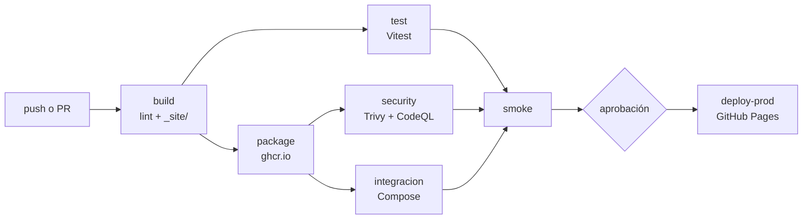

# Perfil — Kiara De La Vega

[](https://github.com/KrisD08/KrisD08.github.io/actions/workflows/ci-cd.yml)

Sitio personal publicado en https://KrisD08.github.io, con un libro de
visitas de tres servicios en contenedores (LAB-02, IF-1116) y un pipeline
de CI/CD que lo construye, prueba, empaqueta, escanea y publica (LAB-03).

---

## El pipeline (LAB-03)

Todo está en [`.github/workflows/ci-cd.yml`](.github/workflows/ci-cd.yml). Cada cambio recorre
estas etapas; si una falla, las que dependen de ella no corren.



| Job | Qué hace | Falla si... |
|---|---|---|
| `build` | Hadolint (Dockerfile), HTMLHint (`index.html`), ESLint (API y JS del navegador); arma `_site/` con solo lo público y lo sube como artefacto de Pages | un linter encuentra un error |
| `test` | Descarga **ese mismo** artefacto y le corre Vitest (`tests/sitio.test.js`) | alguna prueba falla |
| `package` | Construye `perfil-web` y `perfil-api` y las sube a GitHub Packages con el tag `sha-<commit>` | no se puede construir o publicar |
| `security` | CodeQL sobre mi código y Trivy sobre las dos imágenes; publica los hallazgos en *Security → Code scanning* | hay una vulnerabilidad `CRITICAL` **con corrección disponible** |
| `integracion` | Levanta `web`+`api`+`db` con Compose usando las imágenes del commit y prueba el contrato de la API pasando por nginx | el contrato de la API no se cumple |
| `smoke` | Descarga `perfil-web` del commit (la misma que escaneó Trivy), la levanta y comprueba `GET /` → 200 con mi nombre | no responde 200 o falta mi nombre |
| `deploy-prod` | Publica `_site/` en GitHub Pages **después de una aprobación manual** y revisa la URL publicada | la página publicada no responde o rompe |

- Un **pull request** llega hasta `smoke`; `deploy-prod` no corre. Solo un **push a `main`** despliega.
- La rama `main` está protegida: no se puede hacer merge si fallan `build`, `test`, `package`, `security`, `integracion` o `smoke`.
- GitHub Pages se publica desde **GitHub Actions** (no desde la rama): solo se sube `_site/`, así que `compose.yaml`, `api/`, `db/` y `.env.example` ya no son públicos.

### Correr lo mismo en mi máquina

```bash
npm ci               # instala Vitest, jsdom, HTMLHint y ESLint
npm run lint:html    # HTMLHint
npm run lint:js      # ESLint
npm run sitio        # arma _site/
npm test             # Vitest sobre _site/
```

---

## Delivery o deployment

⟦PENDIENTE: revisa este texto y reescríbelo con tus palabras. En la defensa oral te preguntan
exactamente esto: "¿qué tendrías que cambiar para que tu pipeline sea Continuous Deployment?"⟧

Mi pipeline es **Continuous Delivery**: de `build` a `smoke` todo es automático, y el paso a producción
(`deploy-prod`) espera a que yo lo apruebe. Esa espera no está en el YAML: la produce el *environment*
`github-pages`, que tiene configurado *Required reviewers*.

**Qué cambiaría para pasar a Continuous Deployment:**

1. En *Settings → Environments → github-pages* quito *Required reviewers*. Con eso `deploy-prod` corre apenas
   termina `smoke`. **No cambia ninguna línea de código del workflow**: es un cambio de configuración.
2. Antes de quitarla, reforzaría lo que hoy cubre mi aprobación: más pruebas (que `smoke` y `integracion`
   sean lo bastante buenos como para confiar sin ver), y la revisión de producción de `deploy-prod`
   (`scripts/comprobar-produccion.mjs`) tendría que **volver atrás sola** si falla, en vez de solo ponerse en rojo.

**En qué casos no lo haría:**

- Cuando un error en producción no se puede deshacer fácil: migraciones de base de datos, correos o
  notificaciones enviadas, borrado de datos. Hoy el libro de visitas tiene una base de datos real (`db`).
- Cuando el contenido necesita una persona que lo revise antes de ser público (textos legales, datos
  personales, el contenido de mi perfil con mi nombre y correo).
- Cuando las pruebas automáticas todavía no cubren lo importante: si el pipeline se pone en verde pero
  nadie probó lo que cambió, quitar la aprobación solo quita la última red de seguridad.
- Cuando hay regulaciones o auditorías que exigen una aprobación explícita y trazable.

Para este perfil personal, que se publica sin API ni base de datos en GitHub Pages, Continuous Deployment
sería razonable. La aprobación la dejé porque el laboratorio pide ver dónde está esa frontera.

---

## Volver a una versión anterior de producción

⟦PENDIENTE: este procedimiento lo tienes que PROBAR y enlazar el run donde lo hiciste (Reto 5).⟧

La regla: **todo cambio a producción pasa por el pipeline**, también el de volver atrás.

1. En GitHub, abre el pull request que causó el problema (o busca su commit de *merge* en `main`) y pulsa **Revert**.
   Eso crea un pull request nuevo con `git revert` del cambio.
2. Ese PR pasa por `build`, `test`, `package`, `security`, `integracion` y `smoke`, igual que cualquier otro.
3. Haz merge, aprueba `deploy-prod` y la versión anterior vuelve a estar publicada.

Alternativas que descarté:

- **Volver a correr un despliegue viejo** (*Re-run all jobs* sobre un run antiguo en Actions): es rápido, pero
  el historial de `main` sigue diciendo que la versión mala es la actual, y los artefactos de Pages expiran
  (1 día por defecto), así que solo sirve *Re-run all jobs* y no *Re-run failed jobs*.
- **Revertir sin PR** (`git push` directo a `main`): la protección de rama lo impide, y con razón.

---

## Reto 1: tiempos del pipeline

⟦PENDIENTE: llena esta tabla con los tiempos reales de la pestaña Actions (duración de cada job). "Antes" =
el run de tu primera versión que funcionó (`_lab03/ci-cd.v1-base.yml`). "Después" = el run con el `ci-cd.yml`
final. No cuentes el tiempo que el job `deploy-prod` espera la aprobación.⟧

| Job | Antes (v1) | Después | Qué cambió |
|---|--:|--:|---|
| build | ⟦ ⟧ | ⟦ ⟧ | caché de npm (`actions/setup-node`) |
| test | ⟦ ⟧ | ⟦ ⟧ | caché de npm; corre **en paralelo** con `package` |
| package | ⟦ ⟧ | ⟦ ⟧ | caché de capas de Docker (`type=gha`); sale del camino de `test` |
| security | ⟦ ⟧ | ⟦ ⟧ | caché de la base de datos de Trivy; Trivy se instala una sola vez |
| integracion | — | ⟦ ⟧ | job nuevo, **en paralelo** con `security` |
| smoke | ⟦ ⟧ | ⟦ ⟧ | sin cambios |
| **Total (de `build` a `smoke`)** | ⟦ ⟧ | ⟦ ⟧ | ⟦ % menos ⟧ |

---

## Bitácora de decisiones

### Reto 1: Imagen mínima con multi-stage

- **Decisión:** el `Dockerfile` de `api/` utiliza dos etapas: `deps` (Node completo, donde se instalan las dependencias con npm) y `runtime`, basada en `gcr.io/distroless/nodejs20-debian12:nonroot`, que únicamente copia `node_modules` y el código final necesario para ejecutar la aplicación.

- **Alternativas que evalué:**
  - `node:20-alpine` como imagen final: es mucho más pequeña que la imagen completa de Node, pero todavía incluye shell y gestor de paquetes que no son necesarios en producción.
  - `node:20-slim`: ofrece mayor compatibilidad al utilizar Debian como base, pero mantiene un tamaño superior frente a una imagen distroless.

- **Por qué elegí esta:** distroless elimina herramientas innecesarias como shell, npm y gestores de paquetes. Esto reduce la superficie de ataque, ya que ante una posible intrusión no existen comandos adicionales disponibles dentro del contenedor. Además, al ser una API desarrollada en JavaScript puro sin dependencias nativas, no existe riesgo de incompatibilidad.

- **Fuentes consultadas:**
  - Página oficial de [`distroless`](https://github.com/GoogleContainerTools/distroless) en GitHub.
  - Documentación oficial de Docker sobre multi-stage builds.

- **Cómo lo verifiqué:** ejecuté `docker images` obteniendo el tamaño optimizado real:

```yaml
REPOSITORY                   TAG       ID             DISK USAGE    CONTENT SIZE
krisd08githubio-api:latest   c9267900c02f   177MB         45.5MB    U
```

- **Qué no me funcionó:** al probar distroless inicialmente, los intentos de ingresar al contenedor mediante comandos como `sh` fallaban porque la imagen no contiene shell ni herramientas del sistema. Esto confirmó la seguridad de la imagen, pero requirió utilizar logs del contenedor para la depuración.


### Reto 2: Arranque ordenado con healthchecks

- **Decisión:** cada servicio cuenta con su propio `HEALTHCHECK` y el archivo `compose.yaml` utiliza `depends_on: condition: service_healthy`, logrando que:
  - `api` espere hasta que `db` se encuentre saludable.
  - `web` espere hasta que `api` esté disponible.

- **Alternativas que evalué:**
  - Utilizar únicamente `depends_on`: inicia los contenedores en orden, pero no garantiza que el servicio interno ya acepte conexiones.
  - Usar un script como `wait-for-it.sh`: permite esperar conexiones, pero agrega una dependencia externa y traslada la responsabilidad del estado saludable fuera de Docker.

- **Por qué elegí esta:** los `HEALTHCHECK` son mecanismos nativos de Docker Compose, no requieren instalar herramientas adicionales y permiten aprovechar correctamente el inicio automático mediante `postStartCommand`.

- **Fuentes consultadas:**
  - Documentación oficial de Docker Compose sobre `healthcheck` y `depends_on`.
  - Manual de la utilidad `pg_isready`.

- **Cómo lo verifiqué:** ejecuté:

```bash
docker compose ps
```

Resultado:

```bash
NAME                   IMAGE                   COMMAND                  SERVICE   STATUS

krisd08githubio-api-1  krisd08githubio-api     "/nodejs/bin/node ap…"   api       Up (healthy)

krisd08githubio-db-1   postgres:16-alpine      "docker-entrypoint.s…"   db        Up (healthy)
```

- **Qué no me funcionó:** inicialmente intenté utilizar `curl` dentro del healthcheck de la API, pero falló debido a que Distroless no incluye herramientas de red. Finalmente se implementó un chequeo utilizando funcionalidades propias de Node.js.


### Reto 3: Nadie es root

- **Decisión:** 
  - `web` utiliza `nginxinc/nginx-unprivileged`, que funciona en el puerto 8080 y ejecuta el proceso con el usuario `nginx`.
  - `api` utiliza `gcr.io/distroless/nodejs20-debian12:nonroot`, ejecutando con el usuario sin privilegios UID 65532.
  - `db` utiliza la imagen oficial de PostgreSQL, que ejecuta el servicio mediante el usuario interno `postgres`.

- **Alternativas que evalué:**
  - Utilizar `nginx:alpine` junto con `USER nginx`: requiere configuraciones adicionales porque el puerto 80 necesita privilegios especiales (`CAP_NET_BIND_SERVICE`).

- **Por qué elegí esta:** reduce la cantidad de configuraciones manuales y utiliza imágenes diseñadas específicamente para ejecución segura sin privilegios administrativos.

- **Fuentes consultadas:**
  - Repositorio oficial de `nginxinc/nginx-unprivileged`.
  - Documentación de seguridad de Google Distroless.

- **Cómo lo verifiqué:** ejecuté:

```bash
for s in web api db; do echo -n "$s: "; docker compose exec $s whoami; done
```

Resultado obtenido:

```bash
api: executable file not found in $PATH
```

Esto ocurre porque Distroless no incluye herramientas como `whoami`, shell u otros binarios del sistema, confirmando que la imagen mantiene un entorno mínimo.

- **Qué no me funcionó:** intentar explorar el contenedor API mediante `docker compose exec api sh` no fue posible debido a que Distroless elimina completamente la consola shell.


### Reto 4: Red segmentada

- **Decisión:** se configuraron dos redes independientes en `compose.yaml`:

  - `frontend`: conecta únicamente `web` con `api`.
  - `backend`: conecta únicamente `api` con `db`.

  La API funciona como único punto intermedio entre ambas redes. Ni la API ni la base de datos exponen puertos directamente hacia el host.

- **Alternativas que evalué:**
  - Utilizar una sola red para todos los servicios: aunque es más simple, permitiría que `web` tenga acceso directo a `db`, aumentando la superficie de exposición.

- **Por qué elegí esta:** aplica el principio de mínimo privilegio, permitiendo que cada servicio solamente tenga comunicación con los componentes necesarios.

- **Fuentes consultadas:**
  - Documentación oficial de Docker Compose sobre redes (`networks`).

- **Cómo lo verifiqué:** intenté realizar pruebas de resolución entre servicios:

```bash
docker compose exec web getent hosts db

docker compose exec api getent hosts db
```

La comprobación desde servicios basados en Distroless no pudo ejecutarse porque no cuentan con herramientas de red instaladas, lo cual demuestra el aislamiento de la imagen base.


- **Qué no me funcionó:** inicialmente al trabajar con una única red por defecto, los servicios tenían comunicación directa entre sí. La separación en dos redes permitió corregir este problema.


### Reto 5: Escaneo de vulnerabilidades

- **Decisión:** se realizó un análisis de seguridad sobre la imagen publicada en GHCR:

```
ghcr.io/krisd08/perfil-api:v1.0
```

utilizando Trivy para identificar vulnerabilidades provenientes de la imagen base y dependencias utilizadas.

- **Alternativas que evalué:**
  - **Trivy (Aquasecurity):** elegida por ser open source, compatible con registros como GHCR y fácil de ejecutar localmente.
  - **Docker Scout:** tiene integración directa con Docker CLI, pero está más ligado al ecosistema comercial de Docker.

- **Por qué elegí esta:** Trivy permite realizar auditorías rápidas mostrando vulnerabilidades del sistema operativo y paquetes utilizados dentro de la imagen.

- **Fuentes consultadas:**
  - Documentación oficial de [Trivy](https://trivy.dev/).
  - Base de datos de vulnerabilidades [AVD](https://avd.aquasec.com/).

- **Cómo lo verifiqué:** ejecuté:

```bash
docker run --rm aquasec/trivy:latest image ghcr.io/krisd08/perfil-api:v1.0
```

Resultado resumido:

```text
CRITICAL: 1
HIGH: 5
MEDIUM: 23
LOW: 25
UNKNOWN: 1
```

- **Análisis de la vulnerabilidad crítica:**

  - **CVE:** `CVE-2026-31789`
  - **Severidad:** CRITICAL
  - **Paquete afectado:** `libssl3` (OpenSSL)

- **Decisión tomada:** se mantiene temporalmente debido a que corresponde a una vulnerabilidad del paquete base Debian y se espera la actualización del parche upstream.

- **Qué no me funcionó:** inicialmente ejecutar Trivy sin indicar correctamente la etiqueta `v1.0` generaba un error de manifiesto desconocido.


### Reto 6: Cero secretos y arranque automático

- **Decisión:** el archivo `.env` está incluido dentro de `.gitignore`, evitando que pueda ser subido al repositorio. Se creó `.env.example` como plantilla con valores de prueba.

Además, dentro de `.devcontainer/devcontainer.json`, el `postCreateCommand` copia automáticamente `.env.example` hacia `.env` únicamente si este archivo todavía no existe.

- **Alternativas que evalué:**
  - Utilizar GitHub Codespaces Secrets: fue descartado porque requiere configuración individual de cuenta y dificulta la evaluación automática del proyecto.

- **Por qué elegí esta:** permite mantener un entorno reproducible y seguro, evitando exponer credenciales reales mientras mantiene el arranque automático en nuevos Codespaces.

- **Fuentes consultadas:**
  - Documentación oficial de Docker Compose sobre `env_file`.
  - Documentación de GitHub Codespaces Secrets.

- **Cómo lo verifiqué:** ejecuté:

```bash
git log --all --full-history -- .env
```

Resultado:

```text
(no se devolvió ningún registro)
```

Esto confirma que el archivo `.env` nunca fue versionado ni enviado al repositorio.

- **Qué no me funcionó:** no se presentaron problemas adicionales debido a que la protección mediante `.gitignore` fue configurada desde el inicio.

---

## Bitácora de decisiones: LAB-03

> ⟦PENDIENTE: cada entrada de abajo es un BORRADOR con las decisiones que quedaron en el código. Antes de
> entregar: (1) léelas y corrige lo que no sea cierto en tu caso, (2) completa cada ⟦PENDIENTE⟧ con el enlace
> real al run de Actions y lo que de verdad te falló, (3) borra las entradas de los retos que no intentaste.
> Busca "⟦" en este archivo: no debe quedar ninguno.⟧

### B3: ¿Cómo le llega `_site/` al job `test`?

- **Decisión:** `build` arma `_site/` y lo sube con `actions/upload-pages-artifact` (artefacto `github-pages`).
  `test` lo baja con `actions/download-artifact` y lo desempaqueta (`tar -xf artefacto/artifact.tar -C _site`).
  `deploy-prod` publica ese mismo artefacto.
- **Alternativas que evalué:**
  - Volver a armar `_site/` en cada job con el mismo script: es simple y no depende de artefactos, pero
    son dos construcciones distintas; si algún día difieren (por ejemplo, un archivo que cambia entre jobs),
    pruebo una carpeta y publico otra.
  - Subir `_site/` además como un artefacto normal con `actions/upload-artifact`: sirve, pero duplica el
    artefacto y de todos modos el que se despliega es el de Pages.
- **Por qué elegí esta:** es el único camino donde lo que se prueba y lo que se publica son exactamente los
  mismos bytes: un solo artefacto, subido una vez, usado por `test` y por `deploy-prod`.
- **Fuentes consultadas:** [`actions/upload-pages-artifact`](https://github.com/actions/upload-pages-artifact)
  (su `action.yml` muestra que empaqueta en `artifact.tar`), [`actions/download-artifact`](https://github.com/actions/download-artifact).
  ⟦PENDIENTE: agrega las que de verdad consultaste.⟧
- **Cómo lo verifiqué:** ⟦PENDIENTE: enlace a un run de `test` en verde, y a otro donde renombraste
  `libro-de-visitas.js` o quitaste un `alt` y `test` se puso en rojo.⟧
- **Qué no me funcionó:** ⟦PENDIENTE: lo que te falló de verdad.⟧

### Reto 1: Pipeline rápido

- **Decisión:** caché de npm en `actions/setup-node` (`cache: npm`), caché de capas de Docker en
  `docker/build-push-action` (`cache-from/cache-to: type=gha`, un `scope` por imagen), caché de la base de
  datos de Trivy (viene incluida en `aquasecurity/trivy-action`) y Trivy instalado una sola vez
  (`skip-setup-trivy`). En paralelo: `test` con `package`, e `integracion` con `security`. `smoke` espera a todos.
- **Alternativas que evalué:**
  - Solo cachés, sin paralelismo: no cambia la estructura del pipeline, pero el camino crítico sigue siendo
    largo.
  - `package` como matriz (`web` y `api` en paralelo): ahorra unos segundos, pero cambia los nombres de los
    checks (`package (web)`) y complica la protección de rama.
- **Por qué elegí esta:** ninguna compuerta se salta: `deploy-prod` sigue exigiendo que pasen todas.
  `test` y `package` no se necesitan entre sí (uno revisa el sitio, el otro construye imágenes).
- **Fuentes consultadas:** ⟦PENDIENTE⟧
- **Cómo lo verifiqué:** ⟦PENDIENTE: enlaces a los dos runs y la tabla de arriba.⟧
- **Qué no me funcionó:** ⟦PENDIENTE⟧

### Reto 2: SAST y resultados a la vista

- **Decisión:** CodeQL (`github/codeql-action`, lenguaje `javascript-typescript`, suite `security-extended`) corre
  en el job `security` sobre `api/app.js` y `libro-de-visitas.js`. Los hallazgos de Trivy se suben en formato
  SARIF con `upload-sarif` (categorías `trivy-web` y `trivy-api`). El permiso extra es `security-events: write`,
  solo en ese job. Además hay un `.trivyignore` con una vulnerabilidad aceptada y su motivo.
- **Alternativas que evalué:** Semgrep (reglas muy flexibles, pero hay que instalarlo, fijar su versión y subir
  el SARIF a mano) y Bandit (solo analiza Python, y mi API es Node.js).
- **Por qué elegí esta:** CodeQL sube sus resultados a Code scanning sin pasos extra y la acción se fija por SHA.
- **Fuentes consultadas:** [`github/codeql-action`](https://github.com/github/codeql-action),
  [`aquasecurity/trivy-action`](https://github.com/aquasecurity/trivy-action). ⟦PENDIENTE: agrega las tuyas.⟧
- **Sobre `.trivyignore`:** ⟦PENDIENTE: cuál CVE aceptaste, de qué paquete, y por qué es una decisión válida y no
  esconder el problema.⟧
- **Cómo lo verifiqué:** ⟦PENDIENTE: captura de Security → Code scanning con hallazgos de las dos herramientas.⟧
- **Qué no me funcionó:** ⟦PENDIENTE⟧

### Reto 3: Pruebas de integración con Compose

- **Decisión:** el job `integracion` crea `.env` desde `.env.example`, descarga `perfil-web` y `perfil-api` del
  commit (las mismas que escanea Trivy) con `compose.ci.yaml`, construye `db`, levanta todo con
  `docker compose up -d --wait --no-build` y corre `scripts/integracion.mjs` contra `http://localhost:8080`
  (es decir, **pasando por nginx**). Si algo falla, un paso con `if: failure()` imprime los logs.
- **Alternativas que evalué:**
  - Escribirlas en Vitest con `fetch`: reutiliza la herramienta, pero `npm test` correría contra una API que no
    existe cuando lo ejecuto en mi máquina o en el job `test`.
  - Un script con `curl`: cero dependencias, pero comparar JSON y mostrar un resumen en bash es incómodo.
- **Por qué elegí esta:** un script de Node con `fetch` (ya está en Node 18+) se puede ejecutar igual en mi
  máquina y en el runner, y genera el resumen del run.
- **Fuentes consultadas:** ⟦PENDIENTE⟧
- **Cómo lo verifiqué:** ⟦PENDIENTE: enlace al run en ROJO con la API rota a propósito, y al run en VERDE cuando la
  arreglaste.⟧
- **Qué no me funcionó:** ⟦PENDIENTE⟧

### Reto 4: Mínimo privilegio y cadena de suministro

- **Decisión:** `permissions: contents: read` para todo el workflow y cada job declara los suyos: solo `package`
  tiene `packages: write`, solo `security` tiene `security-events: write`, solo `deploy-prod` tiene
  `pages: write` e `id-token: write`. Todas las acciones de terceros se fijan con el SHA completo (con el tag en
  un comentario), y `.github/dependabot.yml` las mantiene al día junto con npm y las imágenes base.
- **Alternativas que evalué:** fijar con tags (`@v4`: se leen mejor, pero un tag se puede mover, como pasó con
  `tj-actions/changed-files`) y `permissions: write-all` (cómodo, pero un paso comprometido podría escribir en
  todo el repositorio).
- **Por qué elegí esta:** un SHA no se puede mover; si alguien compromete una acción, mi pipeline sigue usando el
  commit que revisé.
- **Fuentes consultadas:** ⟦PENDIENTE⟧
- **Cómo lo verifiqué:** ⟦PENDIENTE: enlace a `ci-cd.yml` y a `dependabot.yml`, y al primer PR de Dependabot.⟧
- **Qué no me funcionó:** ⟦PENDIENTE: por ejemplo, los PR de Dependabot reciben un `GITHUB_TOKEN` de solo lectura,
  así que `package` no puede subir imágenes en esos PR. Cuenta qué hiciste.⟧

### Reto 5: Revisar producción y volver atrás

- **Decisión:** después de `actions/deploy-pages`, el paso `scripts/comprobar-produccion.mjs` entra a la URL
  publicada (`page_url`) y comprueba: (1) responde 200, con reintentos porque Pages tarda unos segundos; (2)
  aparece mi nombre; (3) ejecuta el JavaScript real de la página en jsdom y verifica que, sin `/api`, el
  libro de visitas queda oculto y no hay errores. Volver atrás: `git revert` por pull request (ver la sección
  "Volver a una versión anterior de producción").
- **Alternativas que evalué:** solo `curl` con `grep` (más simple, pero no prueba que el JavaScript no rompa la
  página) y un navegador real con Playwright (más fiel, pero tarda mucho más para un smoke).
- **Por qué elegí esta:** prueba el código de verdad sin descargar un navegador.
- **Fuentes consultadas:** [`actions/deploy-pages`](https://github.com/actions/deploy-pages) (salida `page_url`).
  ⟦PENDIENTE: agrega las tuyas.⟧
- **Cómo lo verifiqué:** ⟦PENDIENTE: enlace al log de esa revisión y al run donde volviste atrás.⟧
- **Qué no me funcionó:** ⟦PENDIENTE⟧

### Reto 6: El pipeline se explica solo

- **Decisión:** cada job escribe en `$GITHUB_STEP_SUMMARY`: `test` la tabla de pruebas (Vitest, vía
  `scripts/resumen-vitest.mjs`), `security` la tabla de vulnerabilidades por severidad (Trivy en JSON, vía
  `scripts/resumen-trivy.mjs`), `integracion` la tabla del contrato de la API y `package` las imágenes publicadas.
  El badge del workflow está arriba, en este README.
- **Alternativas que evalué:** la plantilla `template` de Trivy (para contar por severidad hay que escribir lógica
  en Go templates) y solo mirar los logs (nadie los abre antes de aprobar).
- **Por qué elegí esta:** Trivy en JSON + un script corto de Node, que además pude probar en mi máquina.
- **Fuentes consultadas:** ⟦PENDIENTE⟧
- **Cómo lo verifiqué:** ⟦PENDIENTE: captura del resumen de un run.⟧
- **Qué no me funcionó:** ⟦PENDIENTE⟧

---
